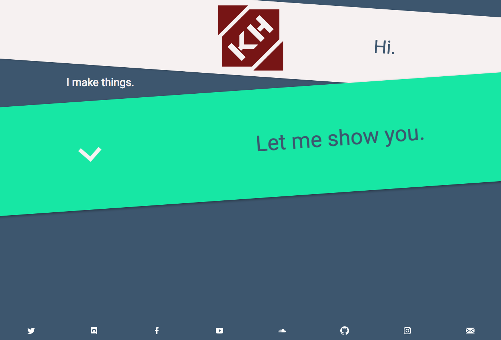

# kasper.space
v4 of my personal website. It uses the ~~[YouTube Data API](https://developers.google.com/youtube/v3/)~~ YouTube RSS feed, ~~the [SoundCloud API](https://developers.soundcloud.com/)~~ and the [GitHub GraphQL API](https://developer.github.com/v4/), as well as some cool [three.js](https://threejs.org/) animation.

## Commands

- `npm run dev`: Start in dev mode
- `npm run build`: Build
- `npm run preview`: Preview production app
- `npm run lint`: Lint
- `npm run format`: Format
